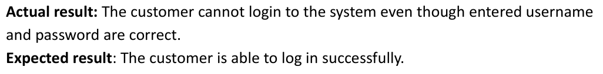

# 🐞 Defect Design: Login Issue

This repository documents a **critical defect** found in the login functionality of a mobile application. It includes a structured defect report, supporting screenshots, and can be used as a reference for **QA testing, bug tracking, or training purposes**.

---

## 📌 Defect Summary

| Field              | Detail                                                                 |
|-------------------|------------------------------------------------------------------------|
| **Defect ID**      | #123                                                                   |
| **Title**          | The customer cannot log in to the system even though entered username and password are correct |
| **Reporter**       | Phatthakan Satariyaratkul                                              |
| **Submit Date**    | 28/04/2025                                                             |
| **Severity**       | High                                                                   |
| **Priority**       | High                                                                   |
| **Assigned To**    | Dev Team                                                               |
| **Software Branch**| Version 1.0.X                                                          |

---

## 🧪 Defect Overview

- **Summary:**  
  The customer is unable to log in even when the correct username and password are entered.

- **defect design from:**  
  

---

## 🖥️ Environment

| Field              | Value        |
|-------------------|--------------|
| **Platform**       | Mobile       |
| **OS**             | Android 13   |
| **Browser**        | N/A          |

---

## 🛠️ Steps to Reproduce

1. Open the app.
2. Navigate to the login page.
3. Enter a valid username and password.
4. Tap the “Login” button.

---

## ✅ Expected Result

The customer is able to log in successfully.

---

## ❌ Actual Result

The customer cannot log in to the system even though the entered username and password are correct.

---

## 🔍 Precondition

- User already has a **valid and active account** in the system.

---

## 📁 Files Included

| File Name             | Description                        |
|-----------------------|------------------------------------|
| `README.md`           | Project summary and documentation  |
| `defect-report.xlsx`  | Detailed defect tracking sheet     |
| `defect-design.png`   | defect report                      |

---

## 📌 Notes

- This defect was found in **Version 1.0.X** of the application.
- The bug is currently open and under investigation by the **development team**.

---

## 📧 Contact

Created by **Phatthakan Satariyaratkul**  
📅 Submitted on: 28 April 2025  
